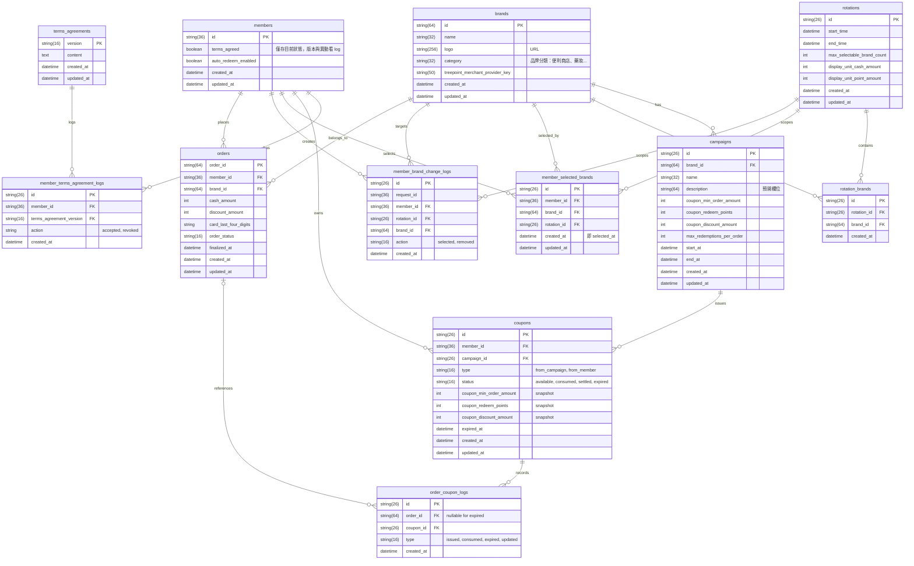

# 樹享券 2.0 Database Schema

## Changelog

| Date | Summary |
| ---- | ------- |
| 2026-06-15 | `coupons` 移除 `issued_at`（與 `created_at` 重複）；移除 `order_coupon_items` 表（快照改於發券時存入 `coupons`）；移除獨立的 `member_auto_redeem_settings` 表（`auto_redeem_enabled` 併入 `members`）；全文 `occurred_at` 統一改為 `created_at`；約束區段 PK 命名去除 table prefix，統一使用 `id` |

---

本文件描述樹享券 2.0 的資料模型設計，使用 Mermaid `erDiagram` 表示核心實體與關聯。

設計原則：

- `coupon_wallet` 是查詢視角，不是獨立資料表。
- active campaign 由 `campaigns.start_at` / `campaigns.end_at` 推導，不另存布林欄位。
- 點數餘額、扣點流水屬外部點數系統，本系統不另外設計點數帳務表。
- 授權狀態以 `members` 主表欄位記錄當前狀態，完整異動歷史由 `member_authorization_logs` 保存。
- API layer 可沿用 `events`、`coupons_used` 等回傳欄位；DB layer 對應名詞統一使用 `order_logs`、`order_coupon_logs`。

## Mermaid ERD

## 關鍵欄位與約束

### members

- 主鍵：`id`
- 作為品牌設定、券、訂單與異動紀錄的關聯主體

### member_authorization_logs

- 主鍵：`id`
- 外鍵：`member_id -> members.id`
- 每次授權動作寫入一筆，不更新、不刪除，保留完整歷史
- `action` enum：
  - `AUTHORIZE`
  - `DEAUTHORIZE`
- `terms_version`：本次動作對應的條款版本
- `created_at`：動作發生時間（UTC+8）

### brands

- 主鍵：`id`
- `treepoint_merchant_provider_key` 必填，不可為 `null`

### campaigns

- 主鍵：`id`
- 外鍵：`brand_id -> brands.id`
- `unit_cash_amount`、`unit_point_amount`、`unit_discount_amount`、`max_redeem_count` 皆應大於 0
- active campaign 以 `start_at <= now <= end_at` 判斷
- 同一 `brand` 同一時間只允許一個 active campaign

### member_selected_brands

- 主鍵：`id`
- 外鍵：
  - `member_id -> members.id`
  - `brand_id -> brands.id`
  - `rotation_id -> rotations.id`
- 建議唯一約束：`(member_id, brand_id)`
- `rotation_key` 於用戶選擇品牌時寫入當下 active rotation，用於 lazy cleanup 判斷是否屬於舊檔期
- 表示用戶目前保留的已選品牌集合

### member_brand_change_logs

- 主鍵：`id`
- 外鍵：
  - `member_id -> members.id`
  - `brand_id -> brands.id`，僅 `PAUSE` / `RESUME` 可為 `null`；`SYSTEM_CLEAR_BRANDS` 時 `brand_id` 非 null，每筆對應一個被清除的品牌
- `request_id` 用於分組同一次品牌操作批次
- `action` enum：
  - `INITIAL_SELECTION`
  - `ADD_BRAND`
  - `REMOVE_BRAND`
  - `PAUSE`
  - `RESUME`
  - `SYSTEM_CLEAR_BRANDS`
- 業務規則：
  - 同一 `request_id` 代表同一次品牌異動操作
  - 初次選牌時，同一批次可寫入多筆 `INITIAL_SELECTION`
  - 一般換牌時，同一批次可混合多筆 `ADD_BRAND` / `REMOVE_BRAND`
  - `PAUSE` / `RESUME` 為單筆事件，且 `brand_id = null`
  - `SYSTEM_CLEAR_BRANDS` 由系統 lazy cleanup 觸發，每筆對應一個被清除的品牌（`brand_id` 非 null），`created_at` 為該 rotation 的 `end_time`
  - 同一 `request_id` 內不可重複出現相同 `action + brand_id`

### coupons

- 主鍵：`id`
- 外鍵：
  - `member_id -> members.id`
  - `campaign_id -> campaigns.id`
- `status` enum：
  - `AVAILABLE`
  - `PROCESSING`
  - `COMPLETED`
  - `EXPIRED`
- `expired_at` 於發券時計算後寫死：
  - `expired_at = (created_at 所在 UTC+8 日期 + coupon_valid_days) 的 23:59:59.999`

### orders

- 主鍵：`order_id`（由發卡主機提供，本系統內唯一）
- 外鍵：
  - `member_id -> members.id`
  - `brand_id -> brands.id`
- `order_status` enum：
  - `PROCESSING`
  - `COMPLETED`
  - `CANCELLED`
- `card_last_four_digits` 僅供前台顯示，不參與清算

### order_logs

- 主鍵：`id`
- 外鍵：`order_id -> orders.order_id`
- `action` enum：
  - `CREATED`
  - `COMPLETED`
  - `CANCELLED`
- 一筆成功 `create_order` 至少建立一筆 `CREATED`
- 成功 `finalize_order` 後再新增一筆 `COMPLETED` 或 `CANCELLED`

### rotations

- 主鍵：`id`
- `start_time` / `end_time` 均為 UTC+8 時間戳記
- active rotation 以 `start_time <= now() <= end_time` 判斷
- 系統同一時間只應有一個 active rotation
- `max_selectable_brand_count`：此檔期用戶最多可選品牌數，取代原 `system_configs.brand_selection_limit`
- `display_unit_cash_amount` / `display_unit_point_amount`：目前用途為前端呈現說明文字（e.g. 「每消費 100 元折抵 10 點」），實際清算依各品牌 campaign 規則，與此欄位無關。未來後台有 campaign 建立介面時，這兩個值將作為新建 campaign 的 default value

### system_configs

- 主鍵：`config_key`
- 至少應包含：
  - `coupon_valid_days`

## 備註

- `coupon_wallet` 對應的是 `coupons` 的查詢投影，可依 `member_id`、`brand_id`、`status` 組合查詢，不需獨立建表。
- `get_member_brand_change_logs` API 若需回傳 `before_brand_ids` / `after_brand_ids`，應以同一 `request_id` 的 `member_brand_change_logs` 批次事件進行重建。
- `get_order` API 的 `events` 對應 `order_logs`；`coupons_used` 對應 `order_coupon_logs`。
